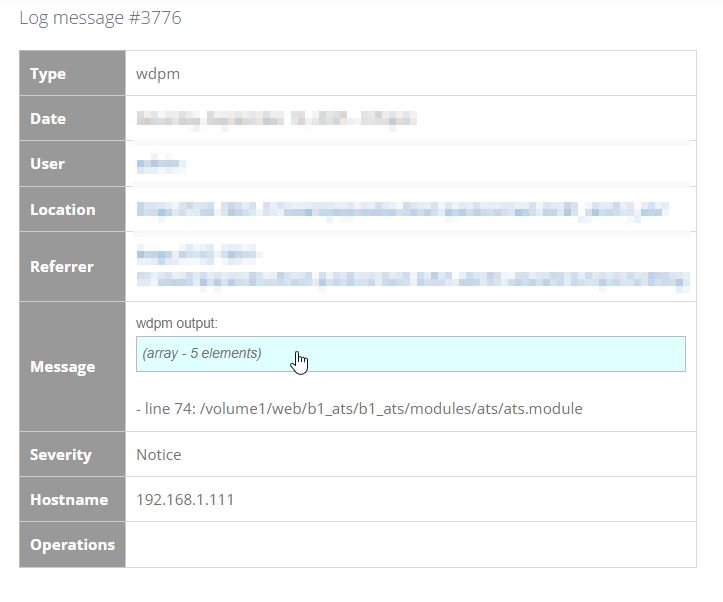
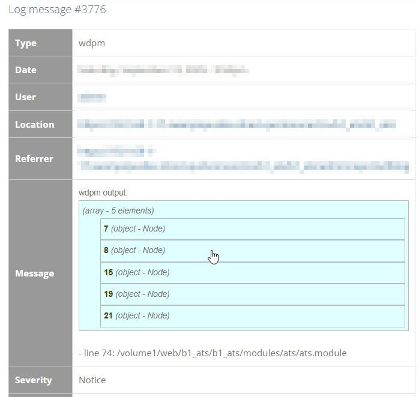
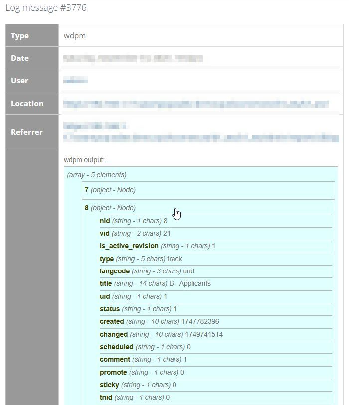

WDPM
==========

If you've used Devel's dpm() function, this module provides similar functionality, 
but for watchdog entries.

Mainly for developers, this lets you have clickable, easy to read information in your 
watchdog entries.

Installation
------------

- **Important!** This module creates "Debug" severity level watchdog entries. To view them,
  you must enable "Debug" logging by visiting admin/config/development/logging
  and checking the "Debug" severity level

- Install this module using the official Backdrop CMS instructions at
  https://backdropcms.org/guide/modules

Help and Functionality
----------------------

Make sure to enable Debug severity logging at admin/config/development/logging.

To use, call `wdpm($variable)` or `wdpm("string")`.  
Then, check admin/reports/dblog for the watchdog entry.  Provides an attractive, 
clickable UI, even for complicated arrays and objects.

**Example (viewing an array of nodes in a watchdog entry):**
(1) 
(2) 
(3) 

Current Maintainers
-------------------

- [Richard Peacock](https://github.com/swampopus) - Original author
- Seeking additional maintainers.

Recommended
-----------

This module works great with:

- [Watchdog Prune](https://github.com/backdrop-contrib/watchdog_prune)
    - So you can auto-delete wdpm entries from your watchdog table after X number of days or weeks.
- [Hook Post Action](https://github.com/backdrop-contrib/hook_post_action)
    - The functions provided by hook_post_action do not display dpm(), so you *must* write
      to the watchdog logs if you need to debug. It's actually the reason this module was made,
      to make that process simpler.

License
-------

This project is GPL v2 software. See the LICENSE.txt file in this directory for
complete text.